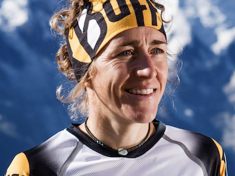
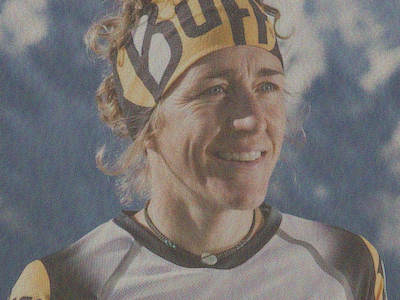
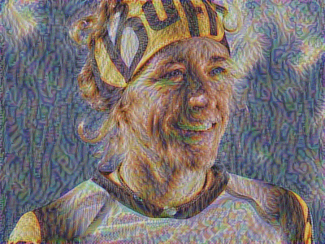

# neuro-transfer
Play with Python and deep learning capabilities to style your photo


## 1. Install docker

## 2. Download usefull files

#### Download your githb repo

#### Download thr pre trained model

Before running, please download the pre-trained model in the following link : [http://www.vlfeat.org/matconvnet/models/imagenet-vgg-verydeep-19.mat](http://www.vlfeat.org/matconvnet/models/imagenet-vgg-verydeep-19.mat) and put it in your local repo folder.


## 3. Select your input image and style image

Note that this images should have a fixed size of 400px (width) X 300px (height)

Place both of them in your ```/images/``` folder

Then open your ```NeuralTransfer.py``` file and change the name of images here : 

```
##load the picture
content_image = scipy.misc.imread("images/**nuria_picas.png**")
content_image = reshape_and_normalize_image(content_image)

##load the style
style_image = scipy.misc.imread("images/**picasso.png**")
style_image = reshape_and_normalize_image(style_image)
```


## 3. launch docker

Build your docker 
```docker build -t neuro-style .```

Run your docker
```docker run neuro-style```

 
## 5. See the result !

<table>
<tr>
  <td></a></td>
  <td> <CENTER><b> + </b></CENTER></td>
  <td></a></td>
</tr>
<tr> <td colspan=3 align=center><b> = </b></td></tr>
<tr>
  <td></a></td>
  <td></a></td>
  <td></a></td>
</tr>
<tr>
  <td>step 0 (init)</td>
  <td>step 20</td>
  <td>step 500 (final)</td>
</tr>
</table>


