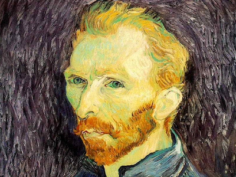

# neuro-transfer

<u>Contents</u> : For Data(Science)-addict and python curious ! Play with Python and deep learning capabilities to style your photo.   

Several implementation of this kind of code already exist. See for instance [this one](https://github.com/anishathalye/neural-style#requirements).  
This repo is another attempt to have fun with neural network capabilities and embrace the wide data-field of what is possible !!

# Which output can you expect from this : 


<table>
<tr>
  <td></a></td>
  <td> <CENTER><b> + </b></CENTER></td>
  <td></a></td>
</tr>
<tr> <td colspan=3 align=center><b> = </b></td></tr>
<tr>
  <td></a></td>
  <td></a></td>
  <td></a></td>
</tr>
<tr>
  <td>step 0 (init)</td>
  <td>step 20</td>
  <td>step 500 (final)</td>
</tr>
</table>

# Curious to understand how it works ? Here we go :  

Let's consider our 2 pictures as 300x400 matrix of Red/Green/Blue vectors

Our 2 main goals are :

1. we want to create an image which looks like our face picture (it could be fun for placing people around the christmas table :) )
2. we want the global style and arrangement of pixels of colors looks like the painting style

To do so we create 2 loss functions that we will combine later on : 

1. **Step 1a** : We apply a pre-trained neural network dedicated to face recognition
 - to the face picture 
 - to a random noise picture of the same size (300x400 pixels matrix)  

  For both, we extract one of the last layer of the neural network (in our case, it is a 19 layers nnet, 16 convolutional layers dedicated to adjust patterns, and 3 final layers to build the image : the current code extract 18th layer).   
  This layer gives us <u>a numerical representation of the input picture</u>.   
If we apply it on both our face picture and a random noise picture, we get to numerical representation.  
To make the picture looks similar, we need to minimize the distance between the 2 numerical representations.   
Here is our **1st loss function**
<br><br>   
2. **Step1b** : We also need to create a numerical representation of the painting style.  
To do so, we use one of the 16 convolutionnal layers of the neural network applied on the painting.   
<br>
How does a convolutionnal layer look like ? It looks like a set of nodes, each node dedicated to recognize a "part" of the input image (a pattern). <i>For instance, a node can be good at detecting eyes, or skin, etc...</i>  
Choosing the layer is arbitrary. It can be optimized (it's an hyperparameter of the model). In the cirrent code, we used the 13th layer.
<br>
The idea here is to find the style of the painting, regardless of **<i>what</i>** is represented.  
To do so, we calculate the correlations between the nodes : it will <u>"normalize the subject of the painting"</u>, and - hence - only keep the style (which is supposed to be the same for the whole painting !).  
It gives us a big matrix per image (painting and random noise).   
Again, the idea will be to minimize the distance between those 2 matrix, to ensure that we're able to make converge the random noise to a "stylish" noise : here is our **2nd loss function**
<br><br>
3. **Step 2 - final** : now that we have both side of the story, we have to finally combined them : the **global loss function** will minimize a weighted sum of the 2 previous loss functions : it will  "force" the output image to comply to both constraints :  
 - **1a** stay close to the input image and 
 - **1b** use the normalized style of painting.
<br>
<br>

##That's it !

---
  
# Installation and launch

<i>Note : see issues and branches to follow latest updates</i>

## 1. Install python

### 1.1 install python engine (version 3)
this code is based on python 3 so you should install last release of this Python version (3.6)

### 1.2 install pycharm (or any python IDE that you like)
You can use pycharm : [https://www.jetbrains.com/pycharm/download/#section=mac](https://www.jetbrains.com/pycharm/download/#section=mac)   

In pycharm, you can select your python engine in ```preferences>project-<your-project-name>]>project interpreter```
  
### 1.3 connect pycharm with your github repo
Note that pycharm can directly connect to your Github Repo : enter your Github Token key (that you can generate [here](https://github.com/settings/tokens) ) and define the local folder where your code is supposed to be cloned.


### 1.4 install packages

You need to have the following packages : 

```import os
import sys  
import scipy.io  
import scipy.misc   
import matplotlib.pyplot as plt
from matplotlib.pyplot import imshow
from PIL import Image
from nst_utils import *
import numpy as np
import tensorflow as tf
```

Note that to use PIL you should open the console in pycharm and install Pillow : 

```pip install Pillow```

 
 
## 2. Download the pre-trained model

Before running, please download the pre-trained model in the following link : [http://www.vlfeat.org/matconvnet/models/imagenet-vgg-verydeep-19.mat](http://www.vlfeat.org/matconvnet/models/imagenet-vgg-verydeep-19.mat) and put it in the same folder.


## 3. Select your input image and style image

Note that this images should have a fixed size of 400px (width) X 300px (height)

Place both of them in your ```/images/``` folder


## 4. Launch your code

in pycharm, you can run chunk of code by selecting them and press [CTRL]+[SHIFT]+[E]

The code will output an image every 20 steps and save it in ```/output/``` folder

## 5. See the result !

