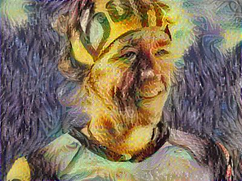

# neuro-transfer
Play with Python and deep learning capabilities to style your photo


## 1. Install python

### 1.1 install python engine (version 3)
this code is based on python 3 so you should install last release of this Python version (3.6)

### 1.2 install pycharm (or any python IDE that you like)
You can use pycharm : [https://www.jetbrains.com/pycharm/download/#section=mac](https://www.jetbrains.com/pycharm/download/#section=mac)   

In pycharm, you can select your python engine in ```preferences>project-<your-project-name>]>project interpreter```
  
### 1.3 connect pycharm with your github repo
Note that pycharm can directly connect to your Github Repo : enter your Github Token key (that you can generate [here](https://github.com/settings/tokens) ) and define the local folder where your code is supposed to be cloned.


### 1.4 install packages

You need to have the following packages : 

```import os
import sys  
import scipy.io  
import scipy.misc   
import matplotlib.pyplot as plt
from matplotlib.pyplot import imshow
from PIL import Image
from nst_utils import *
import numpy as np
import tensorflow as tf
```

Not that to use PIL you should open the console in pycharm and install Pillow : 

```pip install Pillow```

 
 
## 2. Download the pre-trained model

Before running, please download the pre-trained model in the following link : [http://www.vlfeat.org/matconvnet/models/imagenet-vgg-verydeep-19.mat](http://www.vlfeat.org/matconvnet/models/imagenet-vgg-verydeep-19.mat) and put it in the same folder.


## 3. Select your input image and style image

Note that this images should have a fixed size of 400px (width) X 300px (height)

Place both of them in your ```/images/``` folder


## 4. Launch your code

in pycharm, you can run chunk of code by selecting them and press [CTRL]+[SHIFT]+[E]

The code will output an image every 20 steps and save it in ```/output/``` folder

## 5. See the result !

<table>
<tr>
  <td></a></td>
  <td> <CENTER><b> + </b></CENTER></td>
  <td></a></td>
</tr>
<tr> <td colspan=3 align=center><b> = </b></td></tr>
<tr>
  <td></a></td>
  <td></a></td>
  <td></a></td>
</tr>
<tr>
  <td>step 0 (init)</td>
  <td>step 20</td>
  <td>step 500 (final)</td>
</tr>
</table>

## 6. How does it work : 

- the pre trained model is a face-recognition model. It has been trained 
